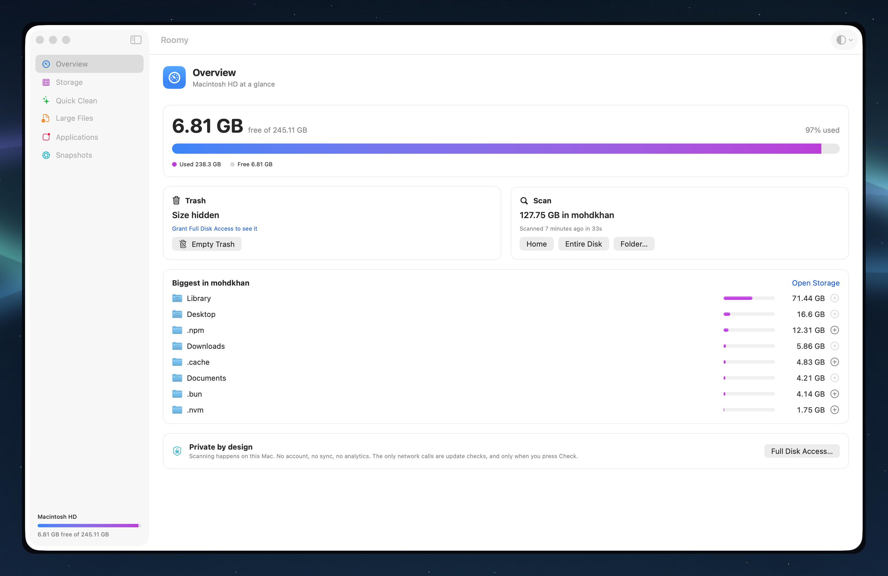

# Roomy

A native macOS app to see what's filling your disk, clean it up safely, and keep an eye on your Mac from the menu bar.

Built with SwiftUI. It's free, open source and runs entirely on your Mac.



## Features

- **Cleanup queue, not a delete button.** Stage things from any screen. A bar floats over the app showing how much space you'll free and what your free space looks like afterwards. Review every item, then move the lot to the Trash.
- **Storage map.** Scan your Home folder, the whole disk or any folder. A block map and a sorted list show where the space went. Click to go inside a folder.
- **Quick Clean.** App caches, logs, Xcode DerivedData, Archives and Device Support, simulator caches, npm/pnpm/bun/pip caches, `node_modules`, `.next` and `.turbo` folders, installers and old files in Downloads.
- **Large files.** Every file over 50 MB, 100 MB, 500 MB or 1 GB.
- **Applications.** Updates from each app's own Sparkle feed and from Homebrew. Login items and launch agents with a switch to turn them off. Uninstall an app together with its support files, caches and preferences.
- **Menu bar monitor.** Free space in the bar itself. Click it for the drive, CPU, memory, battery, network, busiest processes and listening ports, with Scan one press away.
- **Snapshots.** Each scan keeps the shape of your folders. Scan again later, compare the two, and see what grew, shrank, is new or is gone.
- **Light and dark.** Match the system, or pick one.
- **Private by design.** Scanning, sizing and matching happen on your Mac. No account, no sync, no analytics. The only network calls are update checks, and only when you press *Check for Updates*.

## Install

Requirements: macOS 14 (Sonoma) or later, and Xcode or the Xcode Command Line Tools (`xcode-select --install`).

```bash
git clone https://github.com/mdanassaif/roomy.git
cd roomy
./build.sh
```

This builds `Roomy.app`, signs it locally and copies it to `/Applications`. Open it from Launchpad or Spotlight.

To update later:

```bash
git pull && ./build.sh
```

### Recommended: Full Disk Access

Go to **System Settings → Privacy & Security → Full Disk Access** and add **Roomy**. It can then measure the Trash, Mail, Messages and other protected folders. Without it, Roomy still works, but some folders show up smaller and emptying the Trash goes through Finder.

## Quick start

1. **Quick Clean → Stage Everything.** Archives and old downloads are left out for you to check yourself.
2. Click **Review…** in the bar at the bottom and remove anything you want to keep.
3. Tick **Also empty the Trash afterwards** to get the space back straight away, then confirm.

Moving things to the Trash doesn't free space until the Trash is emptied.

## Safety

- Nothing is deleted without going through the review sheet.
- By default, items go to the Trash, where you can put them back.
- System locations (`/System`, `/usr`, your Home, Library, Desktop, Documents and so on) and Apple apps are protected and can't be staged.

## Project layout

```
Sources/Roomy/
  Core.swift        scanner, file tree, volume info, safety rules, snapshots
  Services.swift    clean categories, apps & updates, startup items, system monitor
  AppModel.swift    app state, cleanup queue, trash
  Components.swift  shared views, treemap
  Rooms.swift       Overview, Storage, Quick Clean, Large Files
  Rooms2.swift      Applications, Snapshots, review sheet, settings
  RoomyApp.swift    app entry, window, menu bar monitor
build.sh            build + install script
```

## License

MIT
